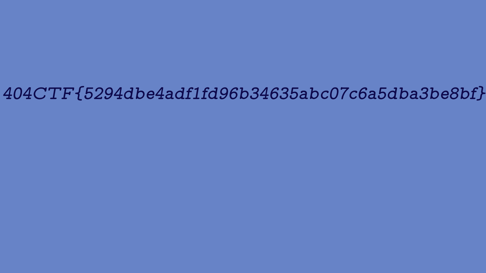

# Poor Random Number Generator [1/2] (Facile)

## Challenge
J'ai chiffré le fichier flag.png. Malheureusement, une partie du clair a fuité. Cependant, j'ai confiance en mon algorithme de chiffrement : un One Time Pad, c'est incassable !

## Inputs
- Python script [encrypt.py](./encrypt.py)
- Python script [my_random.py](./my_random.py)
- Encoded flag image [flag.png.enc](./flag.png.flag)
- Partial flag image [flag.png.part](./flag.png.part)

## Analysis
The flag image is encrypted by blocks by simply `xoring` each block with some bytes generated by `Generator` from `my_random.py`:

```python
def encrypt(data,block_size):
	padded_data = pad(data,block_size)
	data_blocks = get_blocks(padded_data,block_size)
	generator = Generator()
	encrypted = b''

	for block in data_blocks:

		rd = generator.get_random_bytes(block_size)
		xored = xor(block,rd)
		encrypted+= xored
	return encrypted
```

Looking at the code of the `Generator`:
- it inits a list of `2000 random bytes`
- each time a new byte is requested, it is generated using that list of `2000 random bytes`, then appended to the list:

```python
class Generator:

	def __init__(self):
		self.feed = [int.from_bytes(os.urandom(1)) for i in range(2000)]
	def get_next_byte(self):
		number = 0

		for i in range(len(self.feed)):
			if i%2==0:
				number += pow(self.feed[i],i,2**8) + self.feed[i]*i
				number = ~number
			else:
				number ^= self.feed[i]*i+i


		number %= 2**8
		self.feed = self.feed[1:]
		self.feed.append(number)
		return number

	def get_random_bytes(self,length):
		random = b''

		for i in range(length):
			random += long_to_bytes(self.get_next_byte())

		return random
```

Now, we have mode than 2000 bytes from the clear flag image:

```console
$ wc -c flag.png.part
2293 flag.png.part
```

Meaning, we can recover the intial `2000 random bytes` from the generator by `xoring` the 2000 first bytes of the encoded flag image with the partial flag image.

After that, since the next generated bytes are only based on the initial `2000 random bytes`, there's no randomness anymore !

## Solution
First we recover the initial `2000 random bytes`:

```python
# Recover the 2000 first generated numbers used for encryption
# Just XOR the first 2000 bytes from plaintext & ciphertext
gen = list(xor(flag_part[:2000], flag_enc[:2000]))
```

Then we modifiy the `Generator` to initialize it with the recovered `2000 bytes`:

```python
class Generator:

	def __init__(self, gen):
		self.feed = gen
# (...)
```

Then we can decrypt the unknown part of the flag image (after the initial `2000 bytes`). Once the `Generator` is initialized with recovered bytes, it will generate the same byte sequence as during the encryption. For decryption, we just `xor` the encrypted part with the generated bytes. It's almost identical as the encryption:

```python
BLOCK_SIZE = 4

def decrypt(data,gen,block_size):
    padded_data = pad(data,block_size)
    data_blocks = get_blocks(padded_data,block_size)
    generator = Generator(gen)
    decrypted = b''
    for block in data_blocks:
        rd = generator.get_random_bytes(block_size)
        xored = xor(block,rd)
        decrypted+= xored
    return decrypted

# After 2000 bytes, the generated numbers completely fill the Generator feed
# But we just recovered those first 2000 generated numbers, so there's no randomness anymore...
dec = decrypt(flag_enc[2000:], gen, BLOCK_SIZE)
```

Here we go:
```console
$ python3 sol.py
[+] Wrote flag.png
$ file flag.png
flag.png: PNG image data, 1920 x 1080, 8-bit/color RGBA, non-interlaced
```



## Python code
Complete solution in [sol.py](./sol.py)

## Flag
> 404CTF{5294dbe4adf1fd96b34635abc07c6a5dba3be8bf}
