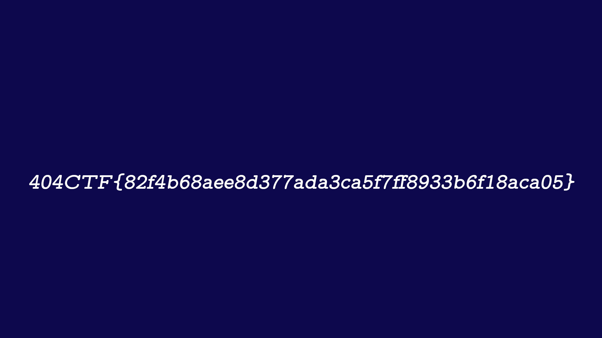

# Poor Random Number Generator [2/2]

## Note
Solved after the competition, after I realized a misuse of the z3 API.

## Challenge
Félicitations ! C'est vrai que mon PRNG précédent n'était pas terrible, on aurait pu voler mes affaires...
Je l'ai donc patché pour pouvoir rentrer habillé ! J'ai chiffré un nouveau fichier PNG et, cette fois-ci, j'ai essayé de limiter les données en clair qui ont fuité. Essayez de casser celui-là.

## Inputs
- Python script [LFSR.py](./LFSR.py)
- Python script [encrypt.py](./encrypt.py)
- Python script [generator.py](./generator.py)
- Encoded flag image [flag.png.enc](./flag.png.flag)
- Partial flag image [flag.png.part](./flag.png.part)

## Analysis
The flag image is encrypted by blocks by simply `xoring` each block with some bytes generated by `Generator` from `generator.py`:

```python
for i in range(len(clear_flag)):
	random = generator.generateByte()
	byte = clear_flag[i:i+1]
	key+=random
	encrypted_flag += xor(byte,random)
```

Looking at the code of the `Generator`:
- it inits a set of `LFSR (Linear Feedback Shift Register)` passed as arguments
- each time a new byte is requested, it is generated using the outputs of those `LFSR`
- the outputs of those `LFSR` are combined using a function also provided as argument, to produce the newly generated byte


Looking at the code of `encrypt.py`, we see the `LFSR` used by the `Generator`, as well as the `combining function`. Of course, the `LFSR` initial state (which is just an array of bits) are random:

```python
#Polynomial representation
poly1 = [19,5,2,1] # x^19+x^5+x^2+x
poly2 = [19,6,2,1] # x^19+x^6+x^2+x
poly3 = [19,9,8,5] # x^19+x^9+x^8+x^5

# initialize states
state1 = [rd.randint(0,1) for _ in range(max(poly1))]
state2 = [rd.randint(0,1) for _ in range(max(poly2))]
state3 = [rd.randint(0,1) for _ in range(max(poly3))]

#combine function
combine = lambda x1,x2,x3 : (x1 and x2)^(x1 and x3)^(x2 and x3)

#Create LFSRs
L1 = LFSR(fpoly=poly1,state=state1)
L2 = LFSR(fpoly=poly2,state=state2)
L3 = LFSR(fpoly=poly3,state=state3)

#Create (secure) generator
generator = CombinerGenerator(combine,L1,L2,L3)
```

The idea is to recover the initial state of those `LFSR`, so that we can generate the same bit stream used to encrypt the image and replay it to decrypt it. To do so, we'll bruteforce it using `z3`.

## Recover the initial state of the `LFSR` using `z3`
So let's use the amazing `z3`. The `LFSR` are initialised as in `encrypt.py`, except the intial states are defined as `BitVect`. I wasn't using that `BitVect` z3 API at first, and only realized the mistake after the competition:

```python
from LFSR import LFSR
from generator import CombinerGenerator
from z3 import *

# Define states as lists of BitVec of size 1
# - Lists  because this is used in LFSR
# - BitVec because of the combination
state1 = [BitVec("state1_%i" % i, 1) for i in range(19)]
state2 = [BitVec("state2_%i" % i, 1) for i in range(19)]
state3 = [BitVec("state3_%i" % i, 1) for i in range(19)]

#Polynomial representation
poly1 = [19,5,2,1] # x^19+x^5+x^2+x
poly2 = [19,6,2,1] # x^19+x^6+x^2+x
poly3 = [19,9,8,5] # x^19+x^9+x^8+x^5

#Create LFSRs
L1 = LFSR(fpoly=poly1,state=state1)
L2 = LFSR(fpoly=poly2,state=state2)
L3 = LFSR(fpoly=poly3,state=state3)
```

Then we recover the `keystream` by `xoring` the partial and the encoded images and turn it into bits:

```python
# Read files
with open("flag.png.part","rb") as f1: flag_part = f1.read()
with open("flag.png.enc","rb")  as f2: flag_enc = f2.read()

# Recover keystream by xoring partial clear flag with encoded flag
def xor(b1, b2): return bytes(a ^ b for a, b in zip(b1, b2))
keystream = xor(flag_part, flag_enc)

# Turn keystream into bits
outputs = []
for b in keystream: outputs += [int(x) for x in bin(b)[2:].rjust(8, '0') ]
```

Then we add the set of constraints to `z3`:
- each generated bit (combined from the output of the 3 `LFSR`) shall equal the corresponding bit in the `keystream`:

```python
def combine(x1, x2, x3):
    return (x1 * x2)^(x2 * x3)^(x1 * x3)

# Add constraints, solve
s = Solver()
for i in range(len(outputs)):
    s.add(outputs[i] == combine(L1.generateBit(), L2.generateBit(), L3.generateBit()))
assert s.check() == sat
```

Finally, recover the initial state of each `LFSR` if a solution was found:

```python
# Recover initial states
m = s.model()
state1 = [m.evaluate(state1[i]) for i in range(19)]
state2 = [m.evaluate(state2[i]) for i in range(19)]
state3 = [m.evaluate(state3[i]) for i in range(19)]
print(f"{state1 = }")
print(f"{state2 = }")
print(f"{state3 = }")
```

And it works !

```console
$ python3 sol.py
state1 = [1, 0, 1, 0, 1, 1, 1, 1, 1, 0, 1, 1, 0, 0, 1, 1, 1, 1, 1]
state2 = [1, 0, 0, 0, 0, 1, 1, 1, 1, 0, 0, 0, 1, 1, 1, 0, 1, 1, 0]
state3 = [1, 1, 0, 1, 0, 0, 1, 0, 0, 0, 1, 0, 0, 0, 1, 1, 1, 1, 1]
```

## Decryption
Now that we recovered the initial state of the `LFSR`, we're able to generate the same bit stream and reply it to decrypt the image. The code is a simple adaptation from `encrypt.py`:

```python
# initialize states
state1 = [1, 0, 1, 0, 1, 1, 1, 1, 1, 0, 1, 1, 0, 0, 1, 1, 1, 1, 1]
state2 = [1, 0, 0, 0, 0, 1, 1, 1, 1, 0, 0, 0, 1, 1, 1, 0, 1, 1, 0]
state3 = [1, 1, 0, 1, 0, 0, 1, 0, 0, 0, 1, 0, 0, 0, 1, 1, 1, 1, 1]
```

```python
#Create (secure) generator
generator = CombinerGenerator(combine,L1,L2,L3)

# Read the encoded flag
with open("flag.png.enc","rb") as f2: flag_enc = f2.read()

# Decrypt the flag
flag = b''.join([ xor(flag_enc[i:i+1], generator.generateByte()) for i in range(len(flag_enc)) ])

# Write decrypted flag
with open("flag.png","w+b") as f: f.write(flag)
print("[+] Written flag.png")
```

And we successfully decrypt the image and recover the flag:

```console
$ python3 decrypt.py
[+] Written flag.png
```



## Flag
> 404CTF{82f4b68aee8d377ada3ca5f7ff8933b6f18aca05}
