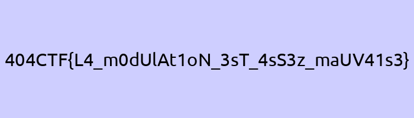

# Comment est votre modulation ? [1/2]

## Challenge
Lors de votre séance bras à la salle, alors que vous faisiez, tant bien que mal, votre dernière répétition un haltère à la main, un inconnu vient vous voir et vous glisse à l'oreille : "L'amplitude, c'est important !". Il vous tend ensuite une clé USB et part en courant. Sur cette clé, vous trouvez un fichier ainsi que le message suivant :
 
- Porteuse : 7kHz
- Fréquence d'échantillonage : 350kHz
- Valence : 256
- Débit : 1000 symboles/sec
- Format : float32
 
> If you don't know what it is, well, just ASK. 

## Solution
Some maths: 1000 symbols /sec and 350000 samples /sec, that's 350 samples /sec.

We have 3283000 samples in the file, that's 9380 symbols.

Modulation valence is 256, meaning 256 modulation states (???). Anyways...

Here's the python script to load samples as `flat32`, group them by 350 samples to get symbols. Then, for each symbol, we take its maximum over the 350 samples, then rescale it to fit into the range (0..255). Finally, we genrate a bytestream out of ut and write it to a file.

```python
import numpy as np
from more_itertools import sliced

# Load signal from file (samples as float32)
signal = np.fromfile("flag.raw", dtype = np.float32)

# Group by 350 samples
symbols = list(sliced(signal, 350))

# Valence is 256 means 256 possible states
# Rescale to fit that range (0..255)
v = 256
l = [min(v-1, int(v*max(symb))) for symb in symbols]

# Build the byte stream
b = b''.join([int.to_bytes(x, length=1, byteorder='big') for x in l])

# Write to file
with open('flag, 'wb') as f:
    f.write(b)
```

After running it, we get a `PNG` file:
```console
$ python3 sol.py
$ file flag
flag: PNG image data, 700 x 200, 8-bit/color RGB, non-interlaced
$ mv flag flag.png
```



## Python code
Complete solution in [sol.py](./sol.py)

## Flag
> 404CTF{L4_m0dUlAt1oN_3sT_4sS3z_maUV41s3}
