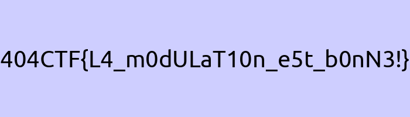

# Comment est votre modulation ? [2/2]

## Challenge
Aujourd'hui c'est séance jambes ! Voilà une semaine que vous appliquez le conseil précédent : "L'amplitude, c'est important !". Alors que vous mettez en œuvre ce conseil, le même homme ressurgit de nulle part et vous dit cette fois : "Il n'y a pas que l'amplitude qui est importante ! Ce n'est qu'une partie des critères qui font une bonne séance". Il vous jette ensuite une clé USB au visage et part en courant. Voici les données qui se trouvent sur cette dernière :

- Porteuse : 7kHz
- Fréquence d'échantillonage : 350kHz
- Valence : 256

## Inputs
- IQ sample: [flag.iq](./flag.iq)
- Python script: [challenge.py](./challenge.py)

## Analysis
Looking at how the `IQ samples` are generated in `challenge.py`, this is `16-QAM OFDM modulation`:

```python
import numpy as np


def QAM16(symbol):
	return -3+2*(symbol>>2)+1j*(3-2*(symbol&0b11))

def OFDM(T,N,X,t):
	return sum([X[k]*np.exp(2j*np.pi*k*t/T) for k in range(N)])

def map_bytes(bytes_list):
	mapped_symbols = []
	for b in bytes_list:
		mapped_symbols += [QAM16(b>>4),QAM16(b&0b1111)]
	return mapped_symbols

NB_SOUS_PORTEUSES = 8
F_C = 7e3
F_E = int(50*F_C)
T_E = 1/F_E
R = 1000
T = 1/R

data = np.fromfile('flag.png', dtype = "uint8")
modulated = []

for i in range(0,len(data),4):
	mapped = np.array(map_bytes(data[i:i+4]))
	modulated += [OFDM(T,NB_SOUS_PORTEUSES,mapped,t*T_E) for t in range(int(F_E*T))]

np.array(modulated,dtype='complex64').tofile("flag.iq")
```

So we simply need to decode those `IQ samples` using `16-QAM OFDM`.

## Solution

```python
import numpy as np
from more_itertools import sliced

def QAM16(symbol):
    return -3+2*(symbol>>2)+1j*(3-2*(symbol&0b11))

qam16_mapping = dict()
for i in range(16):
    b = str(bin(i)[2:].rjust(4, '0'))
    s = QAM16(i)
    qam16_mapping[s] = b
#print(qam16_mapping)
# {(-3+3j): '0000', (-3+1j): '0001', (-3-1j): '0010', (-3-3j): '0011', (-1+3j): '0100', (-1+1j): '0101', (-1-1j): '0110', (-1-3j): '0111', (1+3j): '1000', (1+1j): '1001', (1-1j): '1010', (1-3j): '1011', (3+3j): '1100', (3+1j): '1101', (3-1j): '1110', (3-3j): '1111'}

def decode_ofdm(samples, nb_samp, n_sc):
    # Demodulate OFDM
    demod = np.fft.fft(samples)
    # Return as many symbols as subcarriers
    symbols = [ round(x.real / nb_samp) + round(x.imag / nb_samp) * 1j for x in demod[:n_sc] ]
    return symbols

# Load signal from file (samples as float32)
signal = np.fromfile("flag.iq", dtype = np.complex64)

# Group by 350 samples
samples = list(sliced(signal, 350))

l = []
for s in range(len(samples)):
    samp = samples[s]
    symbols = decode_ofdm(samp, 350, 8)
    for i in range(0, len(symbols), 2):
        # Demap bytes (4MSB and 4LSB) using QAM16 symbol mapping
        msb4 = qam16_mapping[symbols[i]]
        lsb4 = qam16_mapping[symbols[i+1]]
        v = int(msb4 + lsb4, 2)
        l.append(v)

# Build the byte stream
b = b''.join([int.to_bytes(x, length=1, byteorder='big') for x in l])

# Write to file
with open('flag', 'wb') as f:
    f.write(b)
```

```console
$ python3 sol.py
$ file flag
flag: PNG image data, 700 x 200, 8-bit/color RGB, non-interlaced
$ mv flag flag.png
```



## Python code
Complete solution in [sol.py](./sol.py)

## Flag
> 404CTF{L4_m0dULaT10n_e5t_b0nN3!}
