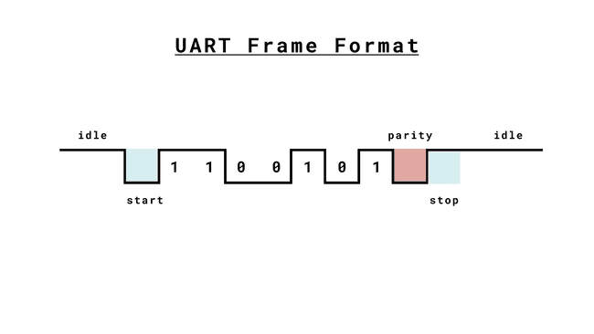

Serial killer

## Challenge
Et votre prochaine épreuve est... le déménagement ? Vous avez donc invité votre amie haltérophile pour vous donner un coup de main et, en deux temps trois mouvements, tout est déballé et rangé. Tout se passait bien jusqu'au moment de rebrancher votre Arduino à votre PC. Elle essaie de rebrancher le port USB, mais ne dose pas sa force et... CRAC ! Le port se casse ! Cet événement vous affecte grandement.

Vous décidez de récupérer et de déchiffrer les dernières paroles que votre Arduino avait transmises à votre ordinateur afin de pouvoir les ajouter à son épitaphe.

> https://docs.arduino.cc/learn/communication/uart/#technical-specifications

## Inputs
- Raw data: [chall.bin](./chall.bin)

## Analysis
Looking at how data is transmitted in the above arduino spec:
- frames are 10bits long
- frame starts with bit 0
- frame ends with bit 1
- frame also includes a parity bit
- frame carries 7 bits of payload (after removing the start, stop and parity bits)



So we just need to split the data by frames of 10bits, drop the start, stop and parity bits, and reassemble the payload.

## Solution
Here's the python code implementing the parsing of the raw data:

```python
from more_itertools import sliced

with open('chall.bin', 'rb') as f:
    data = f.read()

bits = ''
for x in data:
    bits += bin(x)[2:].rjust(8, '0')

# Split in frames or 10 bits
frames = list(sliced(bits, 10))

# Parse the frames of 10 bits
# extract the payload (and invert it for some reason)
msg = ''
for f in frames[:-1]:
    # start bit must be 0
    # end bit must be 1
    assert f[0] == '0'
    assert f[9] == '1'
    # drop the parity bit
    data = int('0b' + f[1:8][::-1], 2)
    msg += chr(data)
print(msg)
```

And we get the flag !

```console
$ python3 sol.py
404CTF{Un3_7r1Ste_f1N_p0Ur_uN3_c4r73_1nn0c3nt3}
```

## Python code
Complete solution in [sol.py](./sol.py)

## Flag
> 404CTF{Un3_7r1Ste_f1N_p0Ur_uN3_c4r73_1nn0c3nt3}
