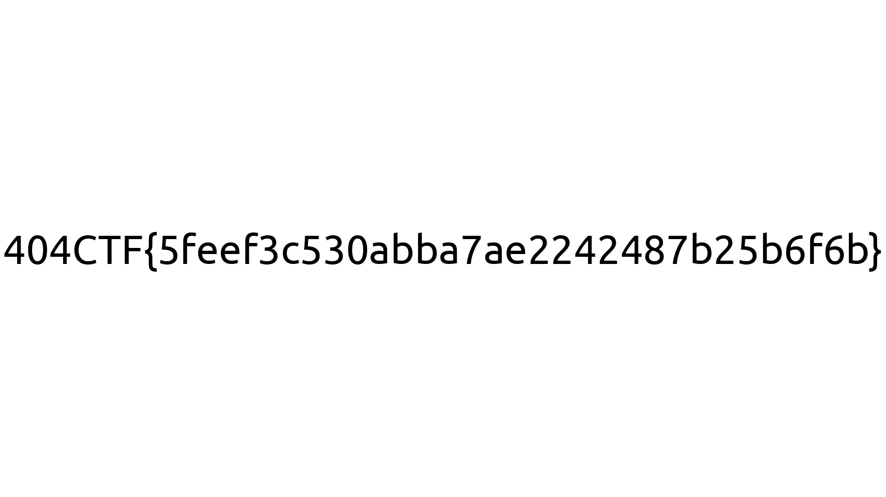

# De la friture sur la ligne (Introduction)

## Challenge
Vous êtes parti ce matin pour une compétition de pêche au bord de la rivière près de chez vous. Malheureusement vous n'avez récupéré que de la friture sur votre ligne et vous êtes fait battre à plate couture. Dépité, sur le chemin du retour, vous tombez sur une étrange clé USB...

## Inputs
- Python script [challenge.py](./challenge.py)
- Set of binary data in 8 files: [channel_1](./channel_1), ..., [channel_8](./channel_8),

## Solution
The encoded flag is split over 8 channels, corresponding to the 8 files we have:
```console
$ for file in $(ls channel_*); do wc -c $file; done
28856 channel_1
28856 channel_2
28856 channel_3
28856 channel_4
28856 channel_5
28856 channel_6
28856 channel_7
28856 channel_8
```

Here's how the data is encoded: kind of `crc` is sent after 7bits of data; That `crc` is just the sum of the 7bits of the data block, modulo 2:
```python
def encode_data(d):
	return list(d)+[sum([e for e in d])%2]

def encode_file(f):
	# Read a file and convert it to binary
	_bytes = np.fromfile(f, dtype = "uint8")
	bits = np.unpackbits(_bytes)
	output = []
	# Encode it for more data integrity safety ;)
	for i in range(0,len(bits),7):
		encoded = encode_data(bits[i:i+7])
		output += encoded.copy()
	return np.array(output,dtype="uint8")
```

Then here is how data is transmitted: each bit ot a data block is sent over channel 1 to 7, then the `crc` is sent over channel 8.
```python
	# Send it to good channel (I hope)
	from_channel_1 = good_channel(to_channel_1)
	from_channel_2 = good_channel(to_channel_2)
	from_channel_3 = good_channel(to_channel_3)
	from_channel_4 = bad_channel(to_channel_4)  # Oups :/
	from_channel_5 = good_channel(to_channel_5)
	from_channel_6 = good_channel(to_channel_6)
	from_channel_7 = good_channel(to_channel_7)
	from_channel_8 = good_channel(to_channel_8)
```

Some noise is randomly added to channel 4:
```python
def good_channel(data):
	return data
def bad_channel(data):
	return (data+np.random.randint(low=0,high=2,size=data.size,dtype='uint8'))%2
```

Knowing the `crc` and the other bits, we can correct the transmission errors on channel 4 like so:

```python
        crc = (int(ch1[i]) + int(ch2[i]) + int(ch3[i]) + int(ch4[i]) + int(ch5[i]) + int(ch6[i]) + int(ch7[i])) % 2
        if crc != int(ch_crc[i]):
            # Bad CRC => bit transmitted on channel #4 is wrong
            ch4_[i] = str((int(ch4_[i]) + 1) % 2)
```

Here's the full code to decode data and recover the flag:
```python
def receive():
    # Read transmitted data from different channels
    ch1 = read_channel(1)
    ch2 = read_channel(2)
    ch3 = read_channel(3)
    ch4 = read_channel(4)
    ch5 = read_channel(5)
    ch6 = read_channel(6)
    ch7 = read_channel(7)
    ch_crc = read_channel(8)

    # Fix noisy channel #4 using CRCs sent on channel #8
    l = len(ch1)
    ch4_ = list(ch4)
    for i in range(l):
        crc = (int(ch1[i]) + int(ch2[i]) + int(ch3[i]) + int(ch4[i]) + int(ch5[i]) + int(ch6[i]) + int(ch7[i])) % 2
        if crc != int(ch_crc[i]):
            # Bad CRC => bit transmitted on channel #4 is wrong
            ch4_[i] = str((int(ch4_[i]) + 1) % 2)
    ch4 = ''.join(ch4_)

    # Now Rebuid the data
    data = [0] * l * 7
    for i in range(l):
        data[7*i]     = ch1[i]
        data[7*i + 1] = ch2[i]
        data[7*i + 2] = ch3[i]
        data[7*i + 3] = ch4[i]
        data[7*i + 4] = ch5[i]
        data[7*i + 5] = ch6[i]
        data[7*i + 6] = ch7[i]

    # Get bytes out of a list of '0' and '1'
    # Probably a better way to do that...
    s = ''.join([str(x) for x in data])
    out = bytes(int(s[i : i + 8], 2) for i in range(0, len(s), 8))
    return out

flag = receive()
save_flag(flag)
```

Here we go:
```console
$ python3 sol.py
[+] Saved flag.png
$ file flag.png
flag.png: PNG image data, 1600 x 900, 8-bit/color RGB, non-interlaced
```



## Python code
Complete solution in [sol.py](./sol.py)

## flag
> 404CTF{5feef3c530abba7ae2242487b25b6f6b}
