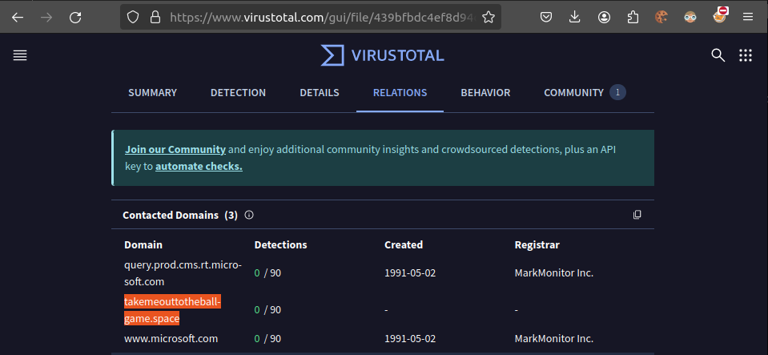
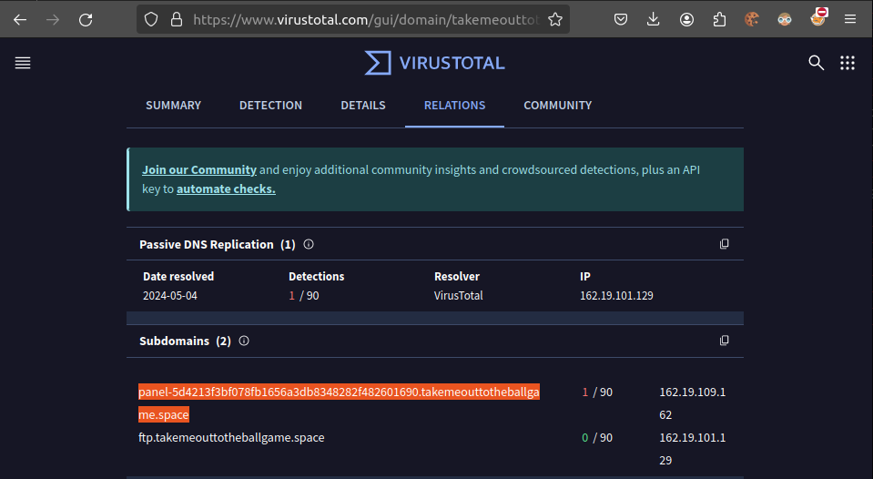
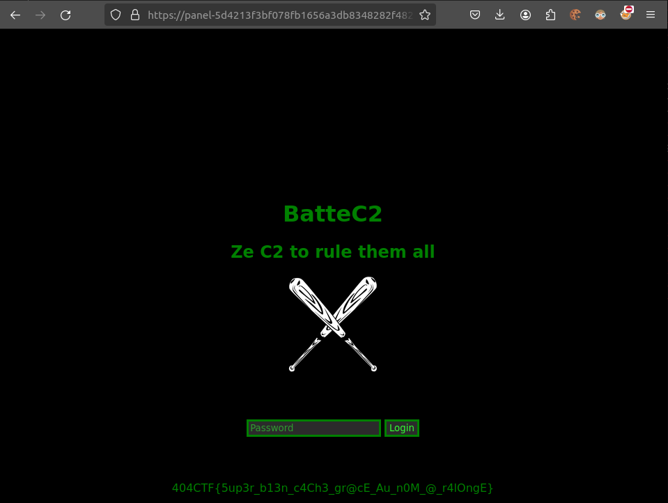

# Coup de circuit [2/3]

## Challenge
Le challenge suivant sera disponible dans la catégorie Divers une fois que vous aurez validé celui-ci.

Super ! Grace à vous j'ai pu retirer le fichier de mon PC, mais pensez-vous qu'il serait possible d'en savoir un peu plus sur ce malware ?

Retrouvez l'interface web du panneau de Command & Control du malware.

Le flag y sera reconnaissable.

## Solution
From part1, we have the `sha1` of the virus: 5cf530e19c9df091f89cede690e5295c285ece3c

Let's throw it to `VirusTotal`

Looking at the contacted domains, the domain `takemeouttotheballgame.space` sticks out:

Following that domain, we find an interesting subdomain `panel-5d4213f3bf078fb1656a3db8348282f482601690.takemeouttotheballgame.space`:

Heading to that subdomain leads us to the C2 panel:

## Flag
> 404CTF{5up3r_b13n_c4Ch3_gr@cE_Au_n0M_@_r4lOngE}
