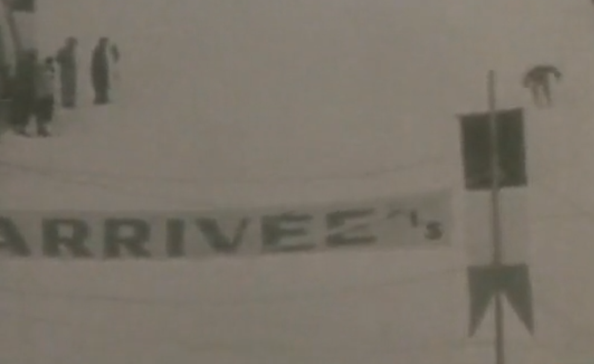
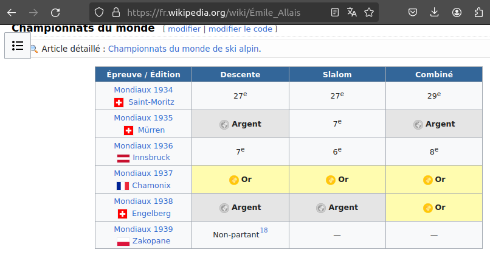

# Légende

## Challenge
Sur cette photo, une des premières légendes du ski français s'apprête à franchir la ligne d'arrivée et remporter son troisième titre de champion du monde cette année. Saurez-vous retrouver son nom et prénom ainsi que le nom de la ville dans laquelle ces compétitions ont eu lieu ?

> Format du flag : 404CTF{jean-michel-dupont_tokyo}

## Solution
From the Wikipedia page of `Emile Allais`:

## Flag 
> 404CTF{emile-allais_chamonix}
