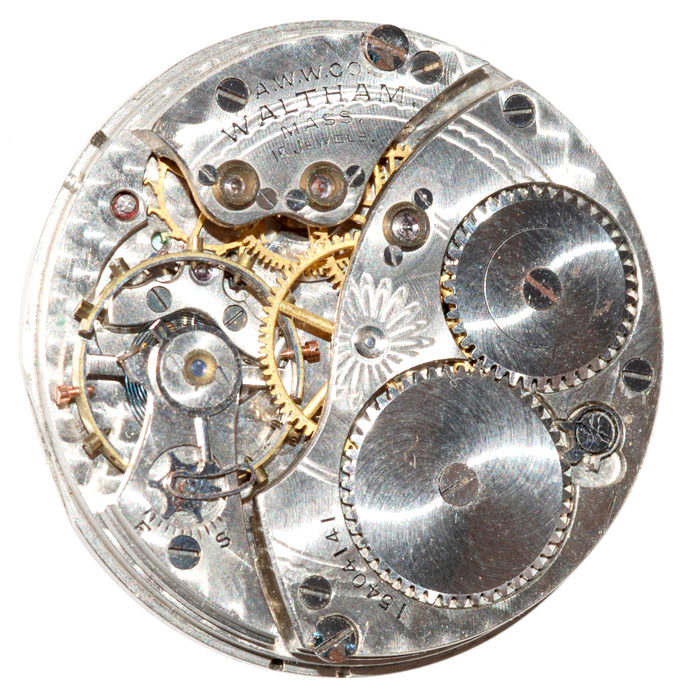

# Not on my watch

## Challenge
Vous êtes arbitre pour l'épreuve de ski de fond et vous accordez une attention particulière à tout ce qui touche au temps.
 
Cependant, en vous réveillant le matin de la compétition, vous vous rendez compte que votre belle montre de poche s'est arrêtée pendant la nuit. Vous la démontez et vous rendez compte que le mécanisme a l'air endommagé.

Sous le coup de la déception, vous entreprenez de trouver un nouveau mécanisme pour celle-ci. Vous vous renseignez donc sur le nombre de mécanismes qui ont été produits.

> Si 1,000,387 mécanismes ont été produits, le format du flag sera:
> Format du flag : 404CTF{1,000,387} 

## Solution
We can read the watch serial number `15404141` on the photo. After googling around a bit, we find the answer on this website: https://pocketwatchdatabase.com

## Flag
> 404CTF{197,100}
